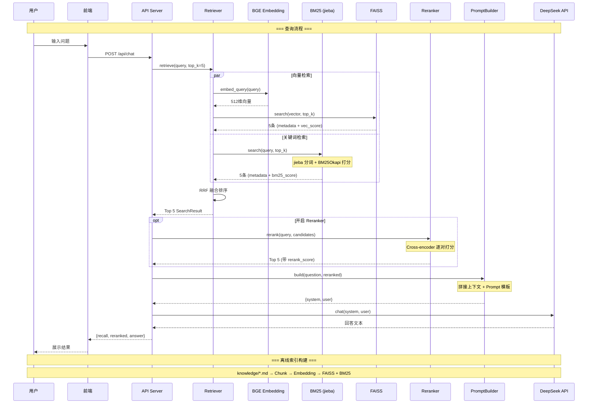

# yuque-agent — 本地 RAG 知识库系统

## 项目概述

一个本地运行的 RAG（Retrieval-Augmented Generation）知识库管道，目标是让个人/团队的 Markdown 文档变成可对话、可语义检索的知识库。

### 完整架构流程



### 一句话说明

---

## 技术栈

### 本地运行（无需联网）

| 技术 | 版本 | 作用 |
|------|------|------|
| `sentence-transformers` | ≥3.0.0 | BGE Embedding 模型 + Cross-encoder Reranker |
| `BAAI/bge-small-zh-v1.5` | — | 中文优化的 512 维向量模型（~100MB），本地召回 |
| `BAAI/bge-reranker-v2-m3` | — | Cross-encoder 精排模型（~2.2GB），对 Top 20 重排序 |
| `faiss-cpu` | ≥1.9.0 | 向量相似度搜索（IndexFlatIP，内积 = 余弦相似度） |
| `langchain-text-splitters` | ≥1.0.0 | 语义感知文本分块（中文分隔符：`。！？`） |
| `rank-bm25` | ≥0.2.2 | BM25 关键词检索 |
| `jieba` | ≥0.42.1 | 中文分词 |
| `pydantic-settings` | ≥2.5.0 | 从 `.env` 加载配置，类型安全 |

### 需联网

| 技术 | 作用 |
|------|------|
| `httpx` ≥0.27.0 | HTTP 客户端 |
| DeepSeek Chat API | 大模型生成回答（仅 Chat 时需要） |

### 运行环境

- Python 3.11+
- 虚拟环境 `.venv/`
- 纯 CPU，无需 GPU

---

## 项目架构

```
yuque-agent/
├── knowledge/                   # 📄 知识文档来源（.md 文件）
├── scripts/                     # 🖥  入口脚本
│   ├── import_markdown.py       #   步骤 1：扫描 knowledge/ → documents.json
│   ├── build_chunks.py          #   步骤 2：分块 → chunks.json
│   ├── build_index.py           #   步骤 3：向量化 + 建 FAISS 索引
│   ├── search.py                #   纯检索（不调 LLM，不需要 API Key）
│   ├── chat.py                  #   完整 RAG 对话（检索 + LLM）
│   └── fetch_all.py             #   从语雀 API 拉取文档（预留）
├── src/                         # 📦 核心库
│   ├── config.py                #   统一配置（从 .env 加载）
│   ├── models/
│   │   ├── document.py          #   Document 数据模型
│   │   └── chunk.py             #   Chunk 数据模型
│   ├── importers/
│   │   ├── base.py              #   导入器抽象基类
│   │   ├── markdown_importer.py #   Markdown 文件导入
│   │   └── yuque_importer.py    #   语雀 API 导入（预留）
│   ├── ingestion/
│   │   └── chunker.py           #   文档分块器
│   ├── embedding/
│   │   └── provider.py          #   Embedding 模型管理（BGE）
│   ├── vectorstore/
│   │   └── faiss_store.py       #   FAISS 向量库
│   ├── retriever/               #   检索器
│   │   ├── retriever.py          #   封装 Hybrid Search + RRF 融合
│   │   └── bm25.py               #   BM25 关键词检索（jieba 分词）
│   ├── reranker/                 #   重排序器
│   │   └── reranker.py           #   Cross-encoder 精排
│   ├── prompt/                   #   Prompt 构建器
│   │   └── builder.py           #   可配置的 Prompt 模板
│   ├── llm/                     #   LLM 模块（独立模块）
│   │   └── deepseek.py          #   DeepSeek API 客户端
│   ├── agent/                   #   🤖 Agent Runtime（Phase 4.5）
│   │   ├── tool.py              #     Tool 抽象 + ToolManager + SearchKnowledgeTool
│   │   ├── memory.py            #     Memory 抽象 + ConversationMemory
│   │   ├── planner.py           #     Planner 抽象 + RuleBasedPlanner
│   │   └── agent.py             #     Agent 编排（Memory → Planner → Tool → LLM）
│   ├── yuque/                   #   语雀 API 客户端（预留）
│   ├── api/                     #   未来 FastAPI 服务（未实现）
│   └── rag/                     #   未来 RAG 编排（未实现）
├── output/                      # 📊 构建产物
│   ├── documents.json           #   序列化的 Document 列表
│   ├── chunks.json              #   序列化的 Chunk 列表
│   ├── index.faiss              #   FAISS 向量索引（二进制）
│   └── metadata.json            #   向量对应的元数据
├── .env                         # 🔐 密钥（不提交 git）
├── .env.example                 #   配置模板
└── requirements.txt             #   依赖清单
```

### 模块职责与设计原则

| 模块 | 职责 | 为什么独立 |
|------|------|-----------|
| `Retriever` | embed → FAISS search → 返回结果 | 检索是独立职责，换向量库只改这里 |
| `PromptBuilder` | 用户问题 + Chunk → 拼接 Prompt | 模板迭代最频繁，不应耦合其他模块 |
| `DeepSeekLLM` | 调用 DeepSeek API 生成文本 | HTTP 请求集中管理，不污染其他模块 |

**关键原则：LLM 不直接查 FAISS。** LLM 只负责调用 API 生成文本，不知道 FAISS 的存在。RAG 增强的是 Prompt，不是 LLM 权重——通过注入检索到的上下文，让 LLM 基于外部知识回答。

---

## 快速开始

### 前置依赖

项目唯一的外部依赖是 **Python 3.11+**，其余全部通过 `pip` 安装。无数据库、无 Docker、无 GPU 要求。

> **为什么是 Python 3.11？** LangChain / LlamaIndex 等 AI 库在 3.11 上兼容性最稳定，Python 3.12+ 部分库有兼容问题。项目已从 3.14 降级到 3.11。

---

### macOS 环境配置

#### 1. 检查 / 安装 Python

```bash
python3 --version
brew install python@3.11
```

#### 2. 创建虚拟环境

```bash
cd /path/to/yuque-agent
python3.11 -m venv .venv
source .venv/bin/activate
```

#### 3. 安装项目依赖

```bash
pip install -r requirements.txt
```

> `sentence-transformers` 首次使用时会自动下载 BGE Embedding 模型（~100MB）。

---

### Windows 环境配置

#### 1. 安装 Python

1. 打开 [python.org/downloads](https://www.python.org/downloads/)，下载 **Python 3.11.x**（不是 3.12 或更高）
2. 运行安装包，**勾选 `Add Python to PATH`**（重要）
3. 完成后打开 PowerShell 验证：

```powershell
python --version
pip --version
```

#### 2. 创建虚拟环境

```powershell
cd C:\path\to\yuque-agent
python -m venv .venv
.venv\Scripts\activate
```

> 如果 Powershell 报执行策略错误，先运行：
> ```powershell
> Set-ExecutionPolicy -ExecutionPolicy RemoteSigned -Scope CurrentUser
> ```

#### 3. 安装项目依赖

```powershell
pip install -r requirements.txt
```

> **Windows 可能需要的额外组件：**
> - `faiss-cpu` 需要 Visual C++ 运行库：[下载 vc_redist.x64.exe](https://aka.ms/vs/17/release/vc_redist.x64.exe)，安装后重试
> - `faiss-cpu` 如仍安装失败，用 conda：`conda install -c conda-forge faiss-cpu`
> - `torch` 用 CPU 版本，不需要 CUDA

#### Windows 注意事项

| 事项 | 说明 |
|------|------|
| 用户名含中文/空格 | HuggingFace 模型缓存路径可能出问题。设置环境变量 `HF_HOME=C:\hf_cache` 可规避 |
| `chmod` 警告 | Windows 不支持 Unix 权限，会出现一条无害警告，可忽略 |

---

### 配置环境变量

编辑 `.env`：

```bash
# 必填：DeepSeek API Key（从 https://platform.deepseek.com/api_keys 获取）
DEEPSEEK_API_KEY=sk-xxxxxxxxxxxxxxxx

# 可选：其余使用默认值
DEEPSEEK_BASE_URL=https://api.deepseek.com
EMBEDDING_MODEL_NAME=BAAI/bge-small-zh-v1.5
RERANKER_MODEL_NAME=BAAI/bge-reranker-v2-m3
```

> `.env.example` 仅作参考模板，实际配置写在 `.env` 中。

### 准备知识文档

将 `.md` 文件放入 `knowledge/` 目录：

```
knowledge/
├── 你的笔记.md
└── 任意子目录/
    └── 任意文件.md
```

### 首次构建索引（执行一次）

```bash
# macOS / Linux
python scripts/import_markdown.py
python scripts/build_chunks.py
python scripts/build_index.py
```

Windows 上把 `/` 换成 `\`。

### 首次启动

```bash
./start.sh          # macOS / Linux
```

Windows：**双击 `start.bat`**。

或手动在 PowerShell 中运行：

```powershell
.venv\Scripts\activate
python scripts\start.py
```

### 首次启动会下载的模型

| 模型 | 大小 | 用途 | 下载时机 |
|------|------|------|----------|
| BAAI/bge-small-zh-v1.5 | ~100 MB | Embedding 向量化 | 首次启动 |
| BAAI/bge-reranker-v2-m3 | ~2.2 GB | Cross-encoder 精排 | 首次启动（可关闭，不开启 Rerank 则不下载） |

> 模型下载一次后缓存到本地，后续启动不再下载。首次启动预计 30-60 秒（含下载 + JIT 预热）。

---

## 使用方式

### 一键启动 Web 界面（推荐，需要 API Key）

```bash
./start.sh
```

一条命令完成：激活环境 → 加载索引 → 启动 HTTP 服务 → 自动打开浏览器。

页面功能：
- 输入问题后点"发送"，回车也可以
- 上方展示检索结果（每条可点击展开），含相似度分数和检索耗时
- 下方展示 AI 回答

`Ctrl+C` 停止服务。

### 语义检索（无需 API Key）

```bash
python scripts/search.py "Python 异步编程" --top 5
```

输出 Top-K 最相关的 Chunk，包含相似度分数。全程本地运行，不联网。

### 交互式 RAG 对话（需要 API Key）

```bash
python scripts/chat.py
```

交互流程：

```
User：你的问题
       │
       ▼
   Retriever      ← BGE 模型本地向量化
       │          ← FAISS 搜索 output/index.faiss
       │          ← 返回 Top-5 相关 Chunk
       ▼
   PromptBuilder  ← 拼接：参考资料 + 用户问题
       │
       ▼
   DeepSeek API   ← 联网调用，生成回答
       │
       ▼
   输出：
   ======== Retrieved ========
   标题 / 路径 / Score / 内容
   ======== LLM Answer ========
   回答正文
```

输入 `q`、`quit` 或 `exit` 退出。

---

## 检索分数说明

每次检索经过四层处理，产生四个分数：

| 分数 | 来源 | 含义 | 范围 |
|------|------|------|------|
| **Vec** | BGE Embedding 模型 | query 和文档的语义向量余弦相似度 | 0 ~ 1，越高越像 |
| **BM25** | jieba 分词 + BM25 | 关键词匹配度，专有名词权重高 | 0 ~ ∞ |
| **RRF** | 融合算法 | 把 Vec 和 BM25 两路排名合并，不看绝对分数看排名 | 0 ~ 0.032 |
| **Rerank** | Cross-encoder 模型 | 同时读问题和文档，打精细相关性分 | -10 ~ 10 |

**流程：** BGE + BM25 各自检索 → RRF 合并排序 → Cross-encoder 对 Top 5 重新排序 → LLM

**耗时分布：**
- 检索（Embedding + BM25 + FAISS + RRF）：~15 ms
- Reranker（Cross-encoder 精排 5 对）：~800 ms
- LLM（DeepSeek API 网络往返）：~4 秒

---

## 注意事项

| 事项 | 说明 |
|------|------|
| **首次 Embedding** | BGE 模型首次运行时从 HuggingFace 下载（~100MB），需确保网络畅通 |
| **索引重建** | 修改 `knowledge/` 后需重新运行步骤 1-3 重建索引 |
| **API Key 安全** | `.env` 已在 `.gitignore` 中，不会提交到 git。不要泄露 Key |
| **性能** | 22 个 Chunk 几乎零开销；上万个 Chunk 后主要瓶颈是内存（Chunk 数 × 向量维度 × 4 字节） |
| **无后台进程** | 所有脚本只在运行时消耗资源，不跑就不耗 |

---

## 性能说明

检索性能由三个因素决定：

| 因素 | 影响 | 说明 |
|------|------|------|
| Chunk 数量 | 内存占用 + 搜索耗时 | `IndexFlatIP` 暴力搜索，线性增长 |
| 文本长度 | 向量化耗时 | Token 数越多编码越慢 |
| 模型大小 | 内存占用 | `bge-small` ≈ 100MB 常驻内存 |

千级 Chunk 以内几乎无感。
